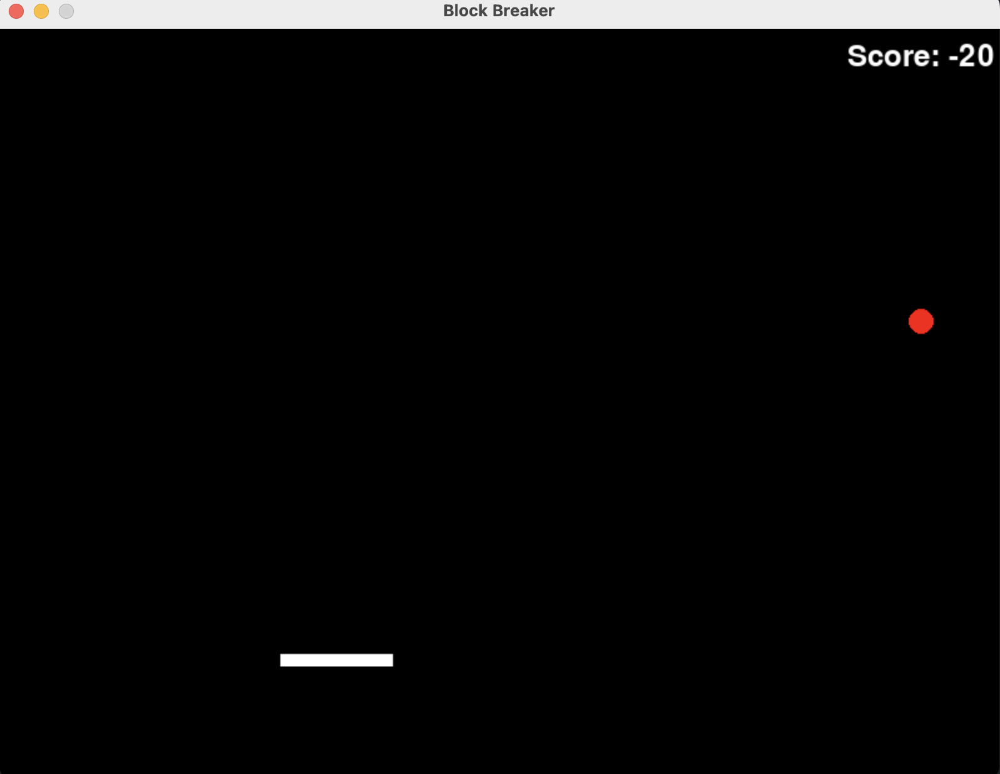

# Block Breaker Game

This is a simple Block Breaker game implemented in Python using the Pygame library.

## Requirements

- Python 3.x
- Pygame library

## Installation

1. Clone the repository:

   ```bash
   git clone https://github.com/ReoF777/block-breaker-game.git
   cd block-breaker-game
   ```

2. Install the required dependecy(Pygame):

    ```bash
    pip install pygame
    ```

3. Usage

    Run the main script to start the game:

    ```bash
    python block_breaker.py
    ```


    

    

    Use the left and right arrow keys to move the paddle.
    Press 'q' to quit the game.

## Gameplay

The objective is to bounce the ball off the paddle and break the blocks at the top of the screen.
Each time the ball hits the paddle, you gain points.
If the ball passes the paddle and goes off the screen, you lose points.
The game continues until you decide to quit.

## Customization

Feel free to customize the game by adjusting variables in the block_breaker.py file, such as the initial position and speed of the ball, paddle speed, block layout, etc.

## License

This project is licensed under the MIT License.